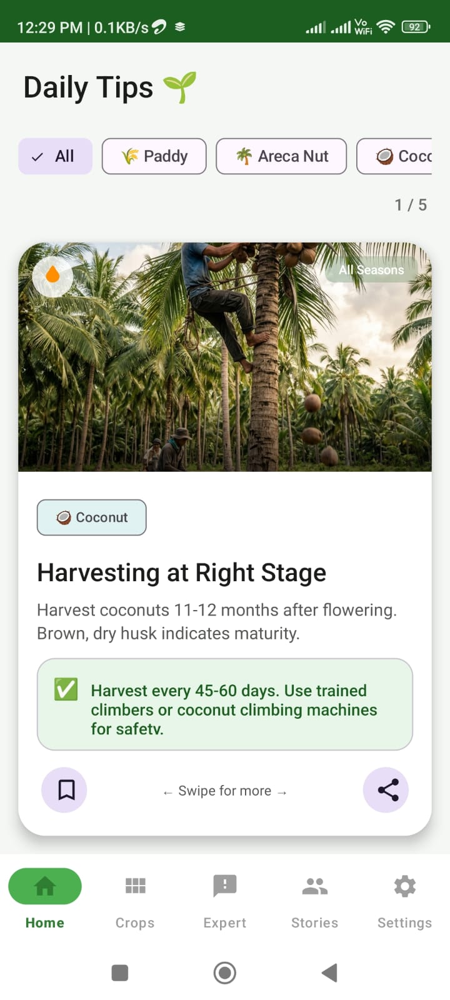
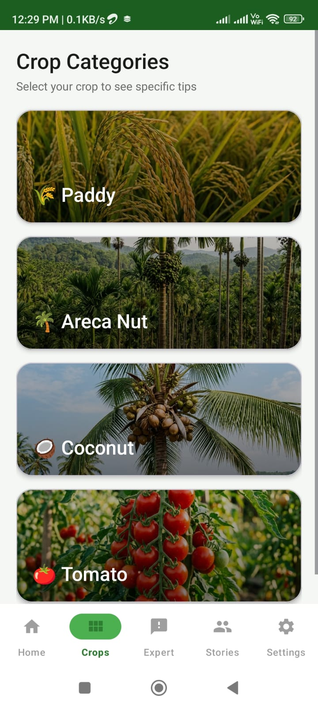
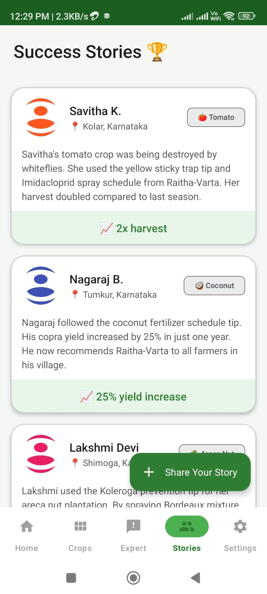
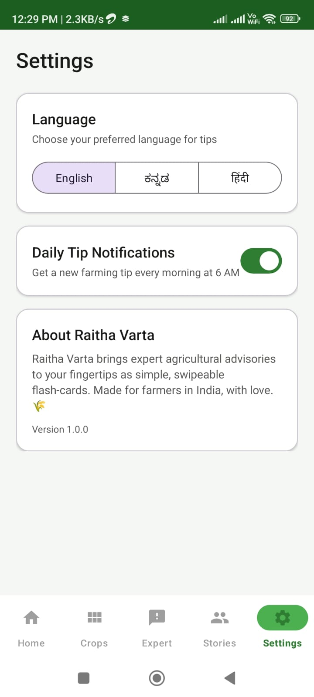

# Raitha-Varta

**Flash-Card Crop Advisory App for Farmers**

## Problem Statement
Traditional agricultural advisories are often long, complex, and difficult for farmers to quickly digest. Many farmers in rural areas lack access to simple, visual content and reliable internet connectivity, making it hard to get timely and actionable advice. There is a strong need for an offline-first, multilingual advisory tool that provides straightforward, visual tips to help improve farming practices.

## Features
* **Swipeable Flash-Cards:** Complex agricultural information broken down into easy-to-digest, swipeable visual cards.
* **Multilingual Support:** Seamlessly switch between English, Kannada, and Hindi to provide access to a wider farming community.
* **Gemini AI Disease Detection:** AI-powered expert advice for plant diseases and treatments using Google Gemini.
* **Offline-First Mode:** Access vital daily tips and saved content even without an active internet connection.
* **Crop Filters:** Easily filter tips and stories based on specific crops (e.g., paddy, areca nut, coconut, tomato).
* **Bookmark & Share:** Save important advisories and share them directly with other farmers.
* **User-Generated Content:** Features allowing farmers to submit their own insights and stories.

## Tech Stack
* **Platform:** Android
* **Languages:** Kotlin / Java
* **Architecture / UI:** ViewPager2 (for swipeable cards), Fragments, Adapters
* **Local Database:** Room Database (for robust offline functionality)
* **Image Loading:** Glide (for rendering realistic imagery and assets)
* **AI Integration:** Google Gemini 2.5 Flash Lite API

## Installation Steps
1. Clone the repository:
   ```bash
   git clone https://github.com/princekumar3033/Raitha-Varta.git
   ```
2. Open the project in **Android Studio**.
3. Wait for Android Studio to sync the project with Gradle files.
4. Obtain a Gemini API key from Google AI Studio and configure it within your environment (e.g., in `local.properties`):
   ```properties
   GEMINI_API_KEY="your_api_key_here"
   ```
5. Clean and rebuild the project.

## Run Command
To build and run the application on a connected device or emulator via terminal:
```bash
# On Windows
gradlew.bat installDebug

# On macOS/Linux
./gradlew installDebug
```
Alternatively, you can just click the **Run 'app'** button (Shift + F10) in Android Studio.

## Screenshots

<p float="left">
  
   
  
</p>
<p float="left">
  
  
</p>

## Folder Structure
```text
Raitha-Varta/
├── app/
│   ├── src/
│   │   ├── main/
│   │   │   ├── java/com/.../raithavarta/ # Source code (Activities, Fragments, Adapters)
│   │   │   ├── res/                      # XML Layouts, vector icons, localized strings
│   │   │   └── AndroidManifest.xml
│   └── build.gradle                      # App-level build configuration
├── assets/                               # Seed data for Hindi, Kannada, English content
├── build.gradle                          # Project-level build configuration
├── raitha-varta-prd.md                   # Product Requirements Document
└── README.md                             # Project Documentation
```

## Future Improvements
* **Weather Integration:** Incorporate real-time local weather forecasts and severe weather alerts.
* **Market Prices:** Add a dedicated section for daily APMC/Mandi crop prices.
* **Community Forum:** Build a discussion platform for farmers to interact and share experiences.
* **More Regional Languages:** Expand language support to include Telugu, Tamil, Marathi, etc.
* **Voice Readout (TTS):** Implement Text-to-Speech to read out flash-cards, increasing accessibility for semi-literate users.
